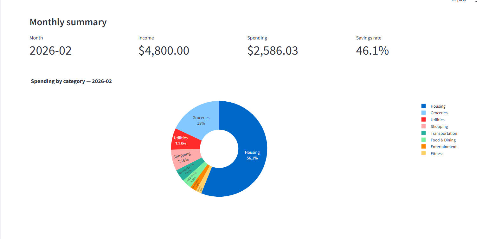
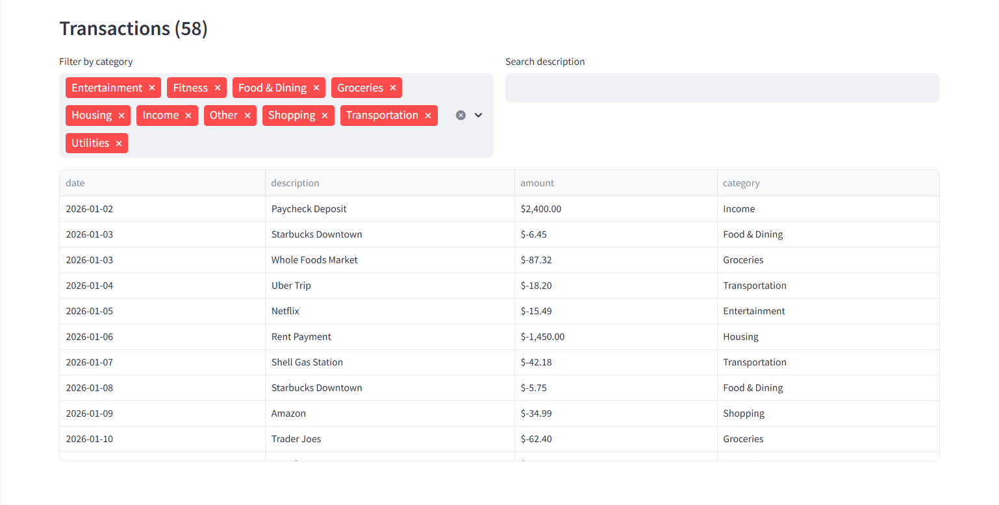
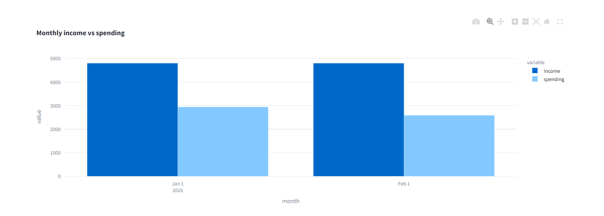
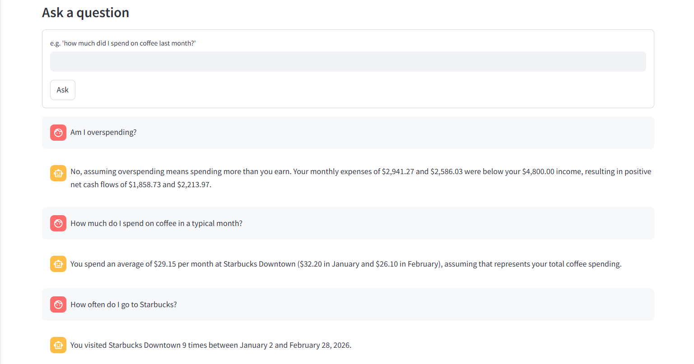
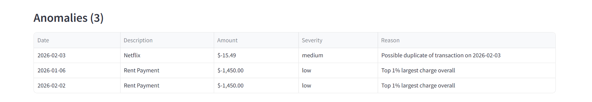

# FinSight

A personal finance agent. Upload a CSV of your transactions and it categorizes them, flags unusual charges, produces a monthly summary, and lets you ask natural-language questions like *"how much did I spend on coffee last month?"*

## Why I built this

Wanted an agentic AI project that works on structured data, not just text. CSVs of transactions felt like a good fit — real-world, a bit messy, and the kind of thing where an agent can actually be useful instead of just being a chatbot wrapper.

## How it works

A LangGraph pipeline with three stages:

1. **Categorize** — keyword rules first (fast, free, no LLM), then optional LLM fallback for unknowns
2. **Detect anomalies** — z-score outliers per category, duplicate-charge detection, top 1% largest spends
3. **Summarize** — monthly totals, savings rate, spending by category, top merchants

Then there's a separate Q&A agent that answers freeform questions against a compact text summary of your data. The summary is pre-computed, so the LLM can't hallucinate numbers — it's just translating the question into a lookup.

## Demo





## Setup

```bash
git clone https://github.com/YOUR_USERNAME/finsight.git
cd finsight

python -m venv venv
source venv/bin/activate  # Windows: venv\Scripts\Activate.ps1

python -m pip install -r requirements.txt

cp .env.example .env
# Edit .env to pick a provider and set the key
```

Then:

```bash
streamlit run src/app.py
```

Opens at http://localhost:8501. Click "Load sample data" in the sidebar to try it without uploading anything.

## LLM backends

Three options, swap via `LLM_PROVIDER` in `.env`. Same pattern as [DevAssist](../devassist):

- **ollama** — local, free, no API key needed. Used for the optional LLM categorization fallback and the Q&A agent.
- **openai** — GPT-4o-mini. Cheap and fast.
- **fireworks** — Kimi K2.5. Fast, 256K context, works well for this.

The categorization stage mostly uses keyword rules (no LLM needed), so you don't spend API calls on routine transactions — only on descriptions the rules can't match.

## CSV format

Your CSV needs three columns: `date`, `description`, `amount`. Column names are case-insensitive and common variants work (`Transaction Date`, `Merchant`, `Value`, etc.). Negative amounts are debits (money out), positive are credits (money in).

Example:
```
date,description,amount
2026-01-05,Starbucks Downtown,-6.45
2026-01-05,Paycheck Deposit,2400.00
```

## Tests

```bash
pytest tests/ -v
```

43 tests covering CSV ingestion (including messy/invalid rows), rule-based and LLM-assisted categorization, anomaly detection logic, monthly summary aggregation, and the full LangGraph pipeline end-to-end.

## Project layout

```
src/
├── app.py         # Streamlit UI
├── tools/         # Ingestion, categorizer, anomaly detector, summary
└── agents/        # LangGraph pipeline + Q&A agent
sample_data/       # Sample CSV for demo
tests/
```


## Tech

Python 3.10+, Streamlit, LangGraph, pandas, plotly, pytest. Ollama / OpenAI / Fireworks for inference.

## License

MIT
